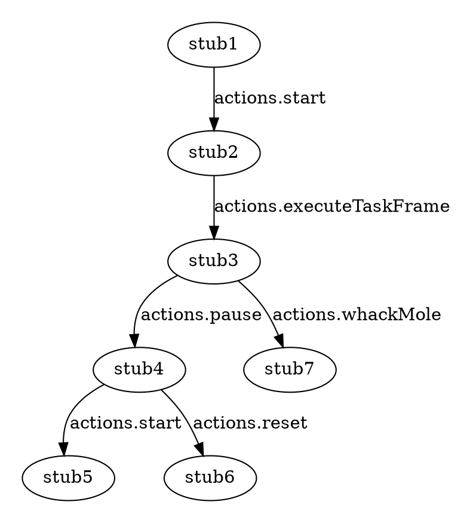

# How to use stubs

In order to ease testing we provide stubs for application state. We generate
application state by manually simulating actions that a user might perform.
We also restrict ourselves to creating stub states by transitioning 
through actions. This is called a markov process.

Use the graphviz diagram below to document and visualize the dependencies

